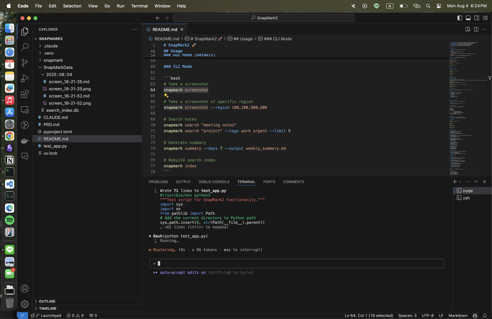

# Screenshot 2025-08-04 18:24:28

**Created:** 2025-08-04 18:24:28
**Image:** screen_18-24-26.png
**Tags:** #test

## Screenshot



## OCR Text

```
@ Code File Edit Selection View Go Run Terminal Window Help xX © @ A) &— O& Q BS Mondsug4 6:24PM
=. a a a — — — — ~
Z % ee@ c= P£ SnapMark2 O Wd ao
-¥ | a EXPLORER +++ @ README.md X BO:
‘ ® \ SNAPMARK2 @® README.md > EJ # SnapMark2 > © ## Usage > ©) ### CLI Mode
; pP > .claude 1 # SnapMark2 # =a :
3 48 ## Usage a
. a) > venv 50 #%# GUL Mode (VeTaULT) a
ja > snapmark 59 a
Ga \ SnapMarkData 60 ### CLT Mode _
‘eB hy ¥ 2025/08/04 - pach ee _
& -21- as —— .
¥ screen_18-21-25.md 63 # Take a screenshot =o a
O "2 screen_18-21-25.png 64 — snapmark screenshot a
65 ¥ screen_18-21-52.md 6 *% aa
‘8B ( screen_18-21-52.png 66 # Take a screenshot of specific region ——
bd Le = scorciy_iactaxdls .. snapmark screenshot --region 100,100,800,600 a
¥ CLAUDE.md 69 # Search notes i
¥ PRD.md 7®  smapmark search "meeting notes" Be
© pyproject.toml 71 snapmark search "project" —-tags work urgent --limit 5 a
f © si,  @ README.md 72 —_—
a A 73 # Generate summary =
= & © test_app.py 74 snapmark summary --days 7 -—-output weekly_summary.md a
ta = uv.lock 75 ae
MN 76  # Rebuild search index ae
77 smapmark index cae
‘© PROBLEMS OUTPUT DEBUGCONSOLE TERMINAL PORTS COMMENTS tyes A Xx
, L Wrote 71 lines to test_app.py | node
#!/usr/bin/env python3
"""Test script for SnapMark2 functionality.""" 2} zsh
import sys
@] import os
from pathlib import Path
# Add the current directory to Python path
sys.path. insert(0, str(Path(__file__).parent) )
= » +61 lines (ctrl+r to expand)
e Bash(python test_app. py)
— L Running...
o> * Mustering.. (@s - * 86 tokens : esc to interrupt)
a
~ >> auto-accept edits on
Uv £33 > OUTLINE
> TIMELINE
Gal 3s Launchpad @OAO WO Ln 64, Col 1 (19 selected) Spaces:3 UTF-8 LF Markdown \& OQ
```

## Notes

<!-- Add your notes here -->
