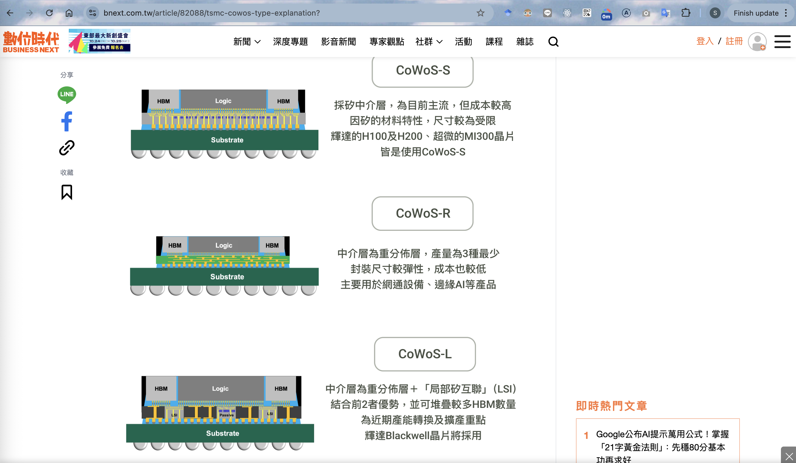

# Screenshot 2025-08-05 13:32:38

**Created:** 2025-08-05 13:32:38
**Image:** screen_13-32-20.png

## Screenshot



## Image Description (VLM)

The image shows a webpage displaying different types of CoWoS (Chip on Wafer on Substrate) technologies. This is from a website named Business Next (bnex.com.tw), and appears to be an informational page about TSMC's CoWoS. There are visual illustrations and descriptions of three CoWoS types:

1. **CoWoS-S**
   - Diagram shows components labeled "Logic" and "HBM" above a "Substrate."
   - Description: Explains CoWoS-S as the mainstream intermediary board, with cost and material characteristics.

2. **CoWoS-R**
   - Similar visual layout with "Logic" and "HBM" over a "Substrate."
   - Description: Details that CoWoS-R has fewer layers, leading to a lower cost.

3. **CoWoS-L**
   - Another diagram with "Logic" and "HBM" above a "Substrate."
   - Description: Mentions internal interconnection and a combination of multiple HBM quantities for improved performance.

**Sidebar features:**
- Sharing options: LINE, Facebook, and a copy link symbol are present.
- Bookmark option represented by a ribbon icon.

**Top Bar and Window Features:**
- Browser interface with multiple open tabs in Chrome.
- Standard menu items like File, Edit, View, History, Bookmarks, Profiles, and Help.
- Website navigation links: News, Feature Topics, Video News, Expert Columns, Community, Activities, Courses, and Magazine.
- Search icon and login options in the upper right corner.

**Footer Notification:**
- A banner at the bottom discusses a countdown of one week to an event.

This information could be stored in an Excel file with the following columns:

| CoWoS Type | Description                  | Diagram Components                  |
|------------|-------------------------------|------------------------------------|
| CoWoS-S    | Mainstream intermediary board, material characteristics lead to high cost | HBM, Logic, Substrate              |
| CoWoS-R    | Fewer layers, reduced cost                                  | HBM, Logic, Substrate              |
| CoWoS-L    | Internal interconnection with many HBM for performance enhancement | HBM, Logic, Substrate              |

Additional information about sharing options and website navigation could also be documented separately if necessary.

## OCR Text

```
@ Chrome File Edit View History Bookmarks Profiles Tab Window Help xX © ®W (A) @ © Q Sf Tuedugsd 1:32PM
o 8 Gia lea im iv) fT Jel flat fous tot fle l [s fo Fas tees

[ = - - ~_ : " ta Ps , — r ali ? c " .. r
: a & bnext.com.tw/article/82088/tsmc-cowos-type-explanation? * o ue S28 ‘om o & Z 6
Bhd Badt a ee ee oa ene) arvana (=
aS os CoWoS-S
I~ ®
a) 2 ROPE > SAME RARE
. p TTT AMM ESH > RRR

y) Substrate #32H9H100H200 . EGMAIMI3Z0088 A
A G (5 FACoWoS-S
16) Bea
- &
CoWoS-R
(3!) Logic

I : a] HESS OE > EBSIEEY
@ schatae HERVE - RABY
2S) SSA ABER As RAIS Eon
0) CoWoS-L
@ 4y aN w faa
= | em Lost a DT RSE G+ REMY EB (LSI)
* es i eis ft GAan2Za eS > woiteR SHBMAS BD be 38 FI37 S
5 +) ee | ARMEESARREBB
Substrate #232 Blackwell&a KiSKAA 1 GoogleAAHETBAAXt |! Siz
a (21 FRSA : eAEBOD A y
ANS! | SERENA RB Eee > HP) een ARDWRERA Tees
```

## Notes

<!-- Add your notes here -->
